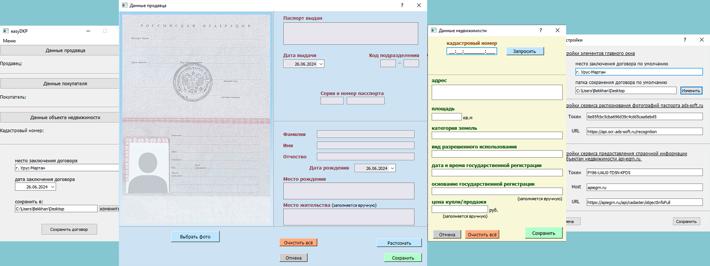

<h1 align="center">fastDKP</h1>
  

## Описание программы

__fastDKP__ - это программа, которая поможет вам ускорить процесс создания договоров купли-продажи
объекта недвижимости, и при этом минимизировать грамматические ошибки, возникающие в основном из-за
невнимательности или случайного нажатия кнопок клавиатуры.

Преимущества создания договора данной программой:
* Программа распознаёт скану/фото паспорта и автоматически заполняет договор паспортными данными 
продавца и покупателя
* Программа отправляет HTTP-запрос на сервис _apiegrn.ru_ по указанному кадастровому номеру и
автоматически заполняет договор данными объекта недвижимости
* Минимум ошибок, благодаря распознованию программой неадекватных входных данных
* Минимум ручного ввода, что позволяет потратить на процесс создания договора менее 1-2 минуты

## Установка и запуск

В данном репозитории представлен исходный код описанной программы. В интернете легко можно найти инструкцию по процессу 
создания __.exe__ установщика из кода, написанного с использованием фреймворка PyQT5. Советую воспользоваться вполне 
детальной инстркуцией по <a href="https://habr.com/ru/articles/487900/" rel="nofollow">ссылке</a>.

После запуска программы в окне настройки введите свои токены от сервиса __ads-soft.ru__ и __apiegrn.ru__, а также 
поменяйте город на свой.

Программа готова к использованию!

## Обратная связь

По всем вопросам пишите мне на почту: 
<a href="mailto:israpal@bk.ru" rel="noopener noreferrer" class="link">Бекхан Исрапилов</a>
